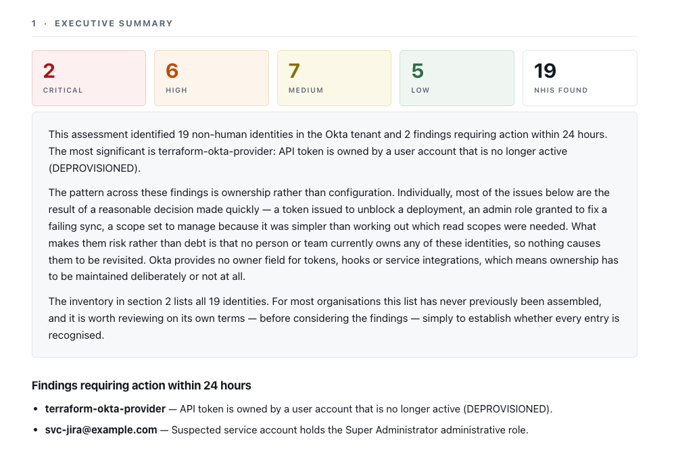

# Okta NHI Audit Tool

Inventories and risk-scores the non-human identities in an Okta tenant —
API tokens, OAuth service integrations, service accounts, hooks, and SCIM
connections — and produces a client-ready assessment report.

Most organisations have a list of their employees. Very few have a list of their
service accounts and API tokens. This builds that list and tells you which
entries are dangerous.



**[View the sample report →](reports/sample_report.html)**

## Try it with zero setup

```bash
pip install -r requirements.txt
python -m src.audit --demo --format html
open reports/audit_demo.html
```

No Okta account, no API token, no network access. `--demo` runs the complete
pipeline against bundled fixture data representing a fictional 40-person company,
and produces the same report a live tenant would. A rendered example is committed
at [`reports/sample_report.html`](reports/sample_report.html).

## What it finds

| NHI type | Where it lives | Why it's risky |
|---|---|---|
| **Org API tokens** | `/api/v1/api-tokens` | Bound to a *human's* privileges at the moment of creation. Creator leaves, token keeps working with their old access. Expires 30 days after **last use**, so a nightly job keeps one alive forever. |
| **API service integrations** | OAuth clients with `client_credentials` | Machine-to-machine, no user context. Scopes are routinely set to `manage` when `read` would do, because it's faster than working out which reads are needed. |
| **Service accounts posing as users** | `/api/v1/users` | Shaped like a human, never logs in interactively, usually MFA-exempt, password lives in a CI variable. Okta has no field marking these — they must be inferred. |
| **Admin roles on any of the above** | `/api/v1/users/{id}/roles` | A Super Admin service account is the worst single finding available in a tenant — and you will find one. |
| **Event hooks & inline hooks** | `/api/v1/eventHooks`, `/api/v1/inlineHooks` | Outbound webhooks carrying identity data to third-party endpoints. Inline hooks run *inside* the auth path and can rewrite token claims. |
| **SCIM provisioning connections** | App provisioning config | Each one holds a standing privileged credential into a downstream SaaS app. Create-without-deactivate silently breaks offboarding. |

Full write-up: [`docs/nhi-taxonomy.md`](docs/nhi-taxonomy.md).

## Design decisions

- **Read-only by design.** No write operations exist in this codebase. Every
  network call routes through one method that is hardcoded to `GET`, and CI
  greps for write verbs on every commit — so the claim can't quietly stop being
  true. An audit tool that can modify the thing it audits is a liability during
  an engagement.
- **Hook destinations are catalogued, never contacted.** Probing a client's
  third-party endpoints is a side effect an audit shouldn't have. Read-only means
  their whole environment, not just their Okta tenant.
- **Heuristic service-account detection is explicitly probabilistic** and
  tunable. Each finding lists the individual signals that produced it, so a
  determination can be contested without dismissing the report. Where the method
  fails is documented in [`docs/false-positives.md`](docs/false-positives.md).
- **Least-privilege scope analysis is measured against Okta's own guidance** on
  scoping API service integrations, not against an opinion of ours.
- **Severity is assigned by stated rules, not computed from summed weights.** The
  reasoning is in [`docs/scoring-methodology.md`](docs/scoring-methodology.md).

## The report is the deliverable

Structured as an assessment rather than a log dump:

1. **Executive summary** — counts by severity, one-paragraph verdict
2. **NHI inventory** — the full categorised list. Most clients have never seen
   this. It's worth the fee on its own.
3. **Findings by severity** — each with evidence, business risk, and remediation
4. **Remediation roadmap** — sequenced: these today, these this month, these this
   quarter
5. **Methodology, scope and limitations** — what was checked, what wasn't, where
   the heuristics fail

Self-contained HTML with inline CSS and no external references, so it survives
being emailed and opened offline.

Every finding carries `risk` and `remediation` written in business language.
"3 orphaned API tokens" is data. This is the deliverable:

> Token `terraform-okta-provider` was created by `wes.brennan@example.com`, whose
> Okta account is DEPROVISIONED. An Okta API token carries the administrative
> privileges its creator held at the moment it was issued, and those privileges
> do not change when the creator's account is deactivated. This credential still
> has whatever access Wes had, but there is no longer a person accountable for
> it, no one who knows what uses it, and no one who would notice if it were
> stolen. Because the 30-day expiry clock resets on every use, an automated job
> keeps this token alive indefinitely.

## Running against a real tenant

```bash
cp .env.example .env      # then fill in OKTA_ORG_URL and OKTA_API_TOKEN
python -m src.audit --format all
```

The API token needs **Read-Only Administrator** at minimum. Super Admin is
required only to list org API tokens (`/api/v1/api-tokens`) — the tool degrades
gracefully without it and records the gap as a scope limitation in the report.

Read-Only Admin is the right ask for a client engagement. It's a materially
easier conversation than requesting Super Admin, and the reason to prefer it is
the same reason this tool exists.

### Options

```
--demo                 run against bundled fixtures; no tenant needed
--format {terminal,html,csv,all}
--output PATH          output path stem for html/csv
--checks a,b,c         subset of: api_tokens, service_accounts, admin_roles,
                       oauth_service_apps, hooks, scim_connections
--threshold 0.0-1.0    service-account heuristic sensitivity (default 0.5)
--fail-on {never,critical,high}   exit non-zero, for CI use
-v, --verbose
```

## Seeding a test tenant

`scripts/seed_tenant.py` builds a deliberately messy tenant in a free Okta
Developer Edition org — service accounts without MFA, an over-scoped OAuth app, a
plaintext event hook, and one correctly-configured service account so the tool
can demonstrate it distinguishes good from bad rather than flagging everything.

```bash
python scripts/seed_tenant.py --dry-run
python scripts/seed_tenant.py --confirm
```

This is the only file in the repository that writes. It lives in `scripts/`,
nothing under `src/` imports it, and CI enforces both. It refuses to run against
an org URL that doesn't look like a developer org.

Org API tokens can't be created through the API — deliberately, and correctly, on
Okta's part — so the script prints console steps for the orphaned-token scenario
and for SCIM configuration.

## Repository layout

```
src/
  okta_client.py        Session, Link-header pagination, 429 backoff, errors
  demo_client.py        Same interface, fixture-backed, for --demo
  scoring.py            Finding model, severity rules, service-account heuristic
  report.py             HTML / CSV / terminal renderers
  audit.py              CLI
  checks/               One module per check
  fixtures/             Demo tenant JSON
scripts/
  seed_tenant.py        Seeds a live dev tenant (writes — see above)
  generate_fixtures.py  Regenerates the demo fixture set
templates/report.html.j2
docs/                   Taxonomy, scoring methodology, false positives
tests/                  pytest against mocked API responses
```

## Development

```bash
pip install -r requirements.txt
python -m pytest -q
```

CI runs the test suite on Python 3.9–3.12, executes the full `--demo` pipeline
end to end, greps `src/` for HTTP write verbs, and scans git history for
token-shaped strings.

## Notes on the Okta API

Three things worth knowing, all of which shaped the client layer:

**Pagination is header-driven.** Okta doesn't use `?page=2`. It returns a `Link`
header containing the complete URL of the next page, including an opaque cursor
you can't construct yourself. You follow the URL Okta hands you.

**Rate limits tell you when to retry.** A 429 comes with `X-Rate-Limit-Reset`, a
Unix timestamp for the window reset. Sleeping until then beats a blind
`sleep(60)`. Developer orgs allow roughly 1,000 requests/minute, and each API
token is capped at 50% of the org limit.

**Okta recommends OAuth over static API tokens**, for the reasons the taxonomy
lays out. Auditing against the vendor's own stated guidance is a stronger
position than auditing against your own.
